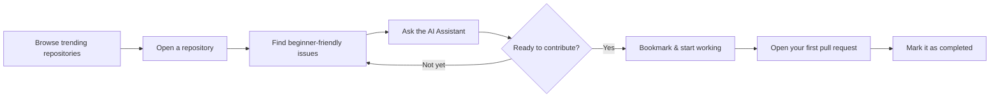
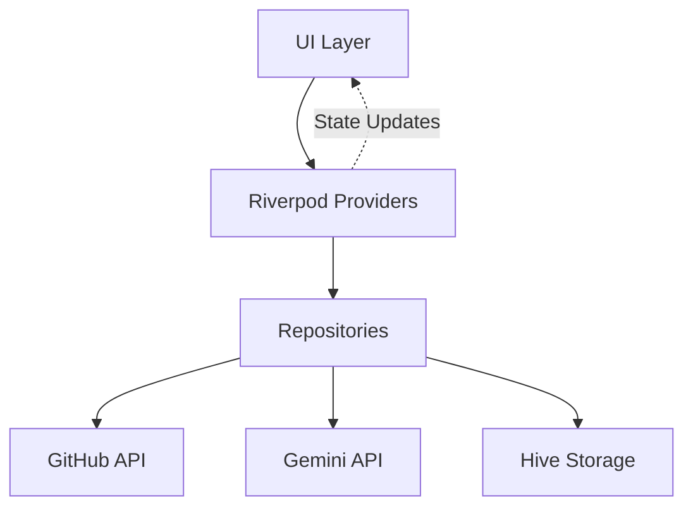

<div align="center">

# 🔥 ForgeOS

### Where you forge your open source career.

**Discover trending repositories, find beginner-friendly issues, and get AI-powered guidance for your first (and hundredth) open source contribution.**

One Flutter codebase. Five platforms. Zero backend. Zero cost.

[](https://flutter.dev)
[](https://dart.dev)
[](LICENSE)
[]()
[](CONTRIBUTING.md)
[](https://github.com/ArsalanKaleem/forgeos/stargazers)

[Live Demo](#) · [Report a Bug](https://github.com/ArsalanKaleem/forgeos/issues) · [Request a Feature](https://github.com/ArsalanKaleem/forgeos/issues) · [Contributing](CONTRIBUTING.md)

<br/>

<!-- Swap this for a real screenshot or product GIF once you have one —
     a 10-second demo GIF here does more for stars than any amount of copy. -->


</div>

<br/>

## 📚 Table of Contents

- [Why ForgeOS](#-why-forgeos)
- [Features](#-features)
- [How It Works](#-how-it-works)
- [Screenshots](#-screenshots)
- [Tech Stack](#️-tech-stack)
- [Architecture](#-architecture)
- [Project Structure](#-project-structure)
- [Getting Started](#-getting-started)
- [Configuration](#-configuration--api-keys)
- [Building for Release](#-building-for-release)
- [Roadmap](#️-roadmap)
- [FAQ](#-faq)
- [Comparison](#-how-is-this-different-from-)
- [Contributing](#-contributing)
- [Support the Project](#-support-the-project)
- [License](#-license)
- [Author](#-author)

---

## 💡 Why ForgeOS

Every developer remembers the exact feeling of wanting to contribute to open source for the first time — and not having the faintest idea where to begin.

GitHub's trending page is noisy and skewed toward already-massive projects. Issue trackers bury the two or three approachable tickets under hundreds of stale, half-triaged, or maintainer-only issues. Labels like `good first issue` exist, but they're scattered across thousands of repositories with no single place to browse them. And even once you find an issue, it's often unclear what it actually *involves* — what files you'll touch, what skills you need, whether it's a five-minute fix or a five-day rabbit hole.

**ForgeOS removes that friction end to end.** It surfaces trending and beginner-friendly repositories, filters GitHub issues down to the ones explicitly labeled for newcomers, and uses AI to explain what an issue actually involves — its difficulty, the skills it requires, and a suggested approach — without ever handing you the full solution. No account required. No backend to trust. No subscription. It runs identically on your phone, your desktop, and in the browser, built entirely on free, public APIs.

If you've ever bookmarked a "how to start with open source" blog post and never acted on it, this is the tool that closes that gap.

---

## ✨ Features

### 🔭 Discover
- 🔥 **Trending repositories** by day, week, or month — filterable by language
- 🔎 **Full repository search** with language, topic, minimum-star, and sort filters
- ⚡ **"Active this week" feed** of recently updated, currently-popular projects — not just perennially famous ones
- ♾️ Infinite scrolling, pull-to-refresh, tasteful skeleton loading states, and clear empty/error states everywhere

### 🎯 Contribute
- 🏷️ **Issue finder** scoped to `good first issue`, `help wanted`, `documentation`, `beginner friendly`, and more — filterable by language and keyword, unassigned issues only, so you never chase a ticket someone already owns
- 📈 **Local contribution tracker** — mark issues *Saved → In Progress → Completed* and watch your own momentum build
- 🔖 **Offline bookmarks** for repositories and issues, with bookmarked READMEs cached for offline reading (great for flights, commutes, spotty wifi)
- 🕘 **Recently viewed** repositories and full search history, so you never lose a promising find

### 🧠 Understand
- 📄 Repository detail pages with rendered Markdown READMEs, syntax-highlighted code blocks, and a dedicated issues tab
- 👤 **GitHub profile viewer** for any user or organization — repos, pinned work, activity at a glance
- 📊 **Optional contribution insights** via the GitHub GraphQL API — good-first-issue counts, help-wanted counts, and commit totals for a repo — unlocked once you add a personal access token

### 🤖 AI Assistant (Gemini free tier)
- 🗣️ **Plain-language explanations** of any issue — what it's really asking for, stripped of jargon
- 🎚️ **Difficulty estimation** (Beginner / Intermediate / Advanced) with the reasoning behind the rating
- 📚 **Recommended learning resources** and prerequisite skills, tailored to the specific issue
- 🧭 **Implementation guidance** — approach and pitfalls, deliberately stopping short of a full solution, because the point is to help you learn, not to write the PR for you
- 🗺️ **Step-by-step learning roadmaps** tailored to a specific repository, for when you want to go deeper than one issue
- 📝 **README summarization** for long or dense projects, so you can decide in thirty seconds whether a repo is worth your time
- 💬 **Follow-up Q&A** in a persistent chat interface — ask anything about the repo or issue you're looking at

### 🎨 Design
- 🌙 Dark theme by default, with a fully-supported light theme
- 🎨 Custom Material 3 palette — deep charcoal navy (`#101820`) with warm amber accents (`#F2AA4C`)
- 🖱️ Hover effects, subtle lift/glow interactions, and smooth transitions on desktop and web
- 📱 Fully responsive — bottom navigation on mobile, navigation rail on tablet and desktop, content max-width capped so nothing stretches awkwardly on ultrawide monitors

---

## 🔄 How It Works



## 📸 Screenshots

<div align="center">
<table>
<tr>
<td></td>
<td></td>
<td></td>
</tr>
<tr>
<td align="center">Trending & Explore</td>
<td align="center">Beginner-Friendly Issues</td>
<td align="center">AI Assistant</td>
</tr>
</table>
</div>


---

## 🏗️ Tech Stack

| Layer | Choice | Why |
|---|---|---|
| Framework | **Flutter** (Web, Android, Windows, macOS, Linux) | One codebase, five real targets, native performance |
| State management | **Riverpod** | Compile-safe, testable, no BuildContext gymnastics |
| Navigation | **GoRouter** (`StatefulShellRoute`) | Deep-linkable, preserves per-tab navigation stacks |
| Networking | **Dio** | Interceptors for auth headers, rate-limit handling, retries |
| Models | **Freezed** + `json_serializable` | Immutable, exhaustive, boilerplate-free data classes |
| Local storage | **Hive** | Fast, cross-platform key-value storage — including Web |
| Markdown & code | `flutter_markdown` + `flutter_highlight` | Renders real READMEs and code blocks faithfully |
| Data sources | GitHub REST API, GitHub GraphQL API, Gemini API (free tier) | No backend of ForgeOS's own — every request goes straight from your device to the source |

Architecture follows a **clean, feature-first structure** with a repository pattern separating data sources from UI — see [`docs/ARCHITECTURE.md`](docs/ARCHITECTURE.md) for a full breakdown.

---

## 🧱 Architecture



- **`core/`** holds everything cross-cutting: theme, router, the Dio client, local storage, and shared widgets/utilities used across every feature.
- **`features/`** is organized by domain, not by layer — each feature owns its providers, screens, and (where relevant) its own data layer.
- Network calls never touch UI code directly; every screen reads from a Riverpod provider, which reads from a repository, which talks to Dio or Hive. This keeps the app testable and makes it straightforward to add a new data source without touching a single widget.

---

## 📁 Project Structure

```
lib/
├── app.dart                    # Root widget — router + theme wiring
├── main.dart                   # Entry point, Hive bootstrap
├── core/
│   ├── constants/               # App-wide constants (name, API bases, labels)
│   ├── network/                 # Dio client, API exception handling
│   ├── router/                  # GoRouter config + adaptive nav shell
│   ├── storage/                 # Hive local storage wrapper
│   ├── theme/                   # Material 3 theme, color palette, radii
│   ├── utils/                   # Formatters, launcher, responsive helpers
│   └── widgets/                 # Shared widgets: hover effects, skeletons,
│                                 # status views, language indicator dots
└── features/
    ├── github/                  # REST + GraphQL data sources, domain models
    ├── explore/                 # Home (trending) + search
    ├── issues/                  # Beginner-friendly issue finder
    ├── repo_details/            # Repository page (README / issues / about)
    ├── ai/                      # Gemini service, prompts, assistant UI
    ├── bookmarks/                # Bookmarks + contribution tracking (offline)
    ├── profile/                  # GitHub profile viewer
    ├── settings/                 # Theme, API keys, data management
    └── about/                    # About screen + About the Developer screen
```

---

## 🚀 Getting Started

### Prerequisites
- [Flutter SDK](https://docs.flutter.dev/get-started/install) 3.27 or newer (Dart ≥ 3.3)
- A GitHub account (optional, only needed for a personal access token — see below)

### Installation

```bash
git clone https://github.com/ArsalanKaleem/forgeos.git
cd forgeos

# Generate platform folders for your targets
flutter create . --platforms=web,android,windows,macos,linux

# Install dependencies
flutter pub get

# Generate Freezed / JSON models — required before first run
dart run build_runner build --delete-conflicting-outputs

# Run
flutter run -d chrome     # Web
flutter run -d windows    # or macos / linux
flutter run                # connected Android device or emulator
```

> Generated `*.freezed.dart` / `*.g.dart` files are gitignored by design — the `build_runner` step above recreates them locally on every fresh clone.

---

## ⚙️ Configuration & API Keys

Both keys below are **free** and **optional** — ForgeOS is fully usable without either, just with lower GitHub rate limits and no AI features.

| Key | Purpose | Where to get it |
|---|---|---|
| **Gemini API key** | Enables all AI Assistant features | [aistudio.google.com/apikey](https://aistudio.google.com/apikey) → paste into **Settings → Gemini API Key** |
| **GitHub personal access token** | Raises the REST rate limit from ~60/hr to 5,000/hr and unlocks GraphQL contribution insights (no scopes required — a plain classic token is enough) | GitHub → *Settings → Developer settings → Personal access tokens* → paste into **Settings → GitHub Token** |

All keys are stored **locally on your device** (via Hive) and are sent only to their respective official APIs. ForgeOS has no backend of its own — there is nothing for it to log, sell, or leak.

---

## 📦 Building for Release

<details>
<summary><strong>Windows</strong></summary>

```bash
flutter build windows --release
```
Output: `build\windows\x64\runner\Release\forgeos.exe`

An Inno Setup script for a proper Windows installer lives at [`installer/forgeos_installer.iss`](installer/forgeos_installer.iss) — compile it with [Inno Setup](https://jrsoftware.org/isinfo.php) to produce a signed-ready `ForgeOS-Setup-x.x.x.exe`.
</details>

<details>
<summary><strong>Android</strong></summary>

```bash
flutter build apk --release        # single APK
flutter build appbundle --release  # Play Store bundle
```
</details>

<details>
<summary><strong>Web</strong></summary>

```bash
flutter build web --release
```
Deploy the `build/web` output to Firebase Hosting, GitHub Pages, Vercel, Netlify, or any static host.
</details>

<details>
<summary><strong>macOS / Linux</strong></summary>

```bash
flutter build macos --release
flutter build linux --release
```
</details>

---

## 🗺️ Roadmap

- [ ] Push notifications for new beginner-friendly issues matching saved filters
- [ ] "Similar repositories" recommendations powered by Gemini
- [ ] Contribution streaks and lightweight gamification for the local tracker
- [ ] Multi-language localization (UI strings)
- [ ] Optional cloud sync of bookmarks across devices (still no mandatory account)
- [ ] Browser extension: "Explain this issue" button injected directly into github.com

Have an idea? [Open a feature request](https://github.com/ArsalanKaleem/forgeos/issues) — roadmap items are pulled straight from real user requests.

---

## ❓ FAQ

**Is this affiliated with GitHub?**
No. ForgeOS is an independent, unofficial client built on the public GitHub REST and GraphQL APIs.

**Does it cost anything?**
No. The app itself is free and open source, and both external APIs it uses (GitHub, Gemini) have generous free tiers that cover normal personal use.

**Do I need to sign in?**
No. Everything works anonymously. A GitHub token is optional and only raises your rate limit — it is never used to authenticate *you*, only to authenticate the request.

**Where is my data stored?**
Entirely on your device, via Hive. Nothing is sent anywhere except the GitHub and Gemini APIs, and only the minimum data each request needs.

**Can I self-host or white-label this?**
Yes — it's MIT licensed. Fork it, rebrand it, ship it.

---

## 🆚 How is this different from…?

| | GitHub Explore | `up-for-grabs.net` | Awesome-list repos | **ForgeOS** |
|---|:---:|:---:|:---:|:---:|
| Cross-platform native app | ❌ | ❌ | ❌ | ✅ |
| Filters issues, not just repos | ❌ | Partial | ❌ | ✅ |
| AI explains issue difficulty | ❌ | ❌ | ❌ | ✅ |
| Offline bookmarks & tracking | ❌ | ❌ | ❌ | ✅ |
| No account required | ✅ | ✅ | ✅ | ✅ |
| Works on mobile | Partial | ❌ | ❌ | ✅ |

---

## 🤝 Contributing

Contributions are genuinely welcome — an app built to help people make their first open source contribution should itself be an approachable one to contribute to. See [`CONTRIBUTING.md`](CONTRIBUTING.md) for setup details, coding conventions, and a list of good-first-issues on this very repo (yes, dogfooding intended).

1. Fork the repository
2. Create a feature branch (`git checkout -b feature/your-feature`)
3. Commit your changes (`git commit -m "Add your feature"`)
4. Push to your branch (`git push origin feature/your-feature`)
5. Open a Pull Request

Even small contributions count — typo fixes, README improvements, and issue triage are just as valuable as code.

---

## ⭐ Support the Project

If ForgeOS helped you land your first open source contribution, the single most useful thing you can do is **star the repo** — it's what gets this in front of the next developer staring at GitHub Explore wondering where to start.

[](https://star-history.com/#ArsalanKaleem/forgeos&Date)

---

## 📄 License

Distributed under the MIT License. See [`LICENSE`](LICENSE) for details.

---

## 👤 Author

**Arsalan Kaleem** — *"Somi"*

Flutter developer building cross-platform apps across mobile, desktop, and web, with a focus on Firebase, real-time systems, and AI-augmented developer tooling. ForgeOS is one of the ways I like to give back to the open source community that taught me most of what I know.

- GitHub: [@ArsalanKaleem](https://github.com/ArsalanKaleem)
- LinkedIn: [linkedin.com/in/arsalankaleem](https://www.linkedin.com/in/arsalankaleem)
- Portfolio: [arsalankaleem.github.io/portfolio](https://arsalankaleem.github.io/portfolio/)

<div align="center">
<br/>

If this project helped you make your first open source contribution, consider giving it a ⭐ — it helps the next person find it too.

</div>